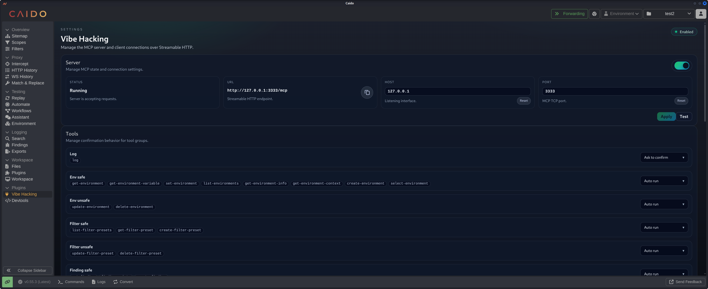

# Vibe Hacking

A Caido MCP plugin that exposes a clean, safe, and well‑documented tool surface for agents. It standardizes tool schemas, descriptions, and behaviors across requests, replay, filters, scopes, tamper rules, and WebSocket history.

## Highlights

- **MCP‑native**: exposes an MCP server over Streamable HTTP inside Caido.
- **Tool governance**: group tools into safe/unsafe buckets and control them with `auto`, `confirm`, or `disabled` modes.
- **Clear UX**: user‑friendly tool names in the UI (no SDK internals).
- **Normalized output**: consistent JSON shape (IDs normalized to numbers where possible, missing bodies surfaced as `null`).



## Install

1. Build the plugin in this repo.
2. Load it in Caido as a local plugin.

> If you already have a dev flow, just build and load as usual.

## Compatibility

- **Caido**: v0.55.1+

## Usage

- Open the plugin page in Caido.
- Use the **Tools** section to set each group to `auto`, `confirm`, or `disabled`.
- Call tools from your agent and rely on consistent JSON outputs.

## Tooling Notes

- Some tools accept arrays even when the name is singular — this is intentional to support batch operations while keeping UI labels simple.
- Replay entries can include raw request data when the request object is missing.

## Development

```bash
pnpm install
pnpm build
```

Watch mode:

```bash
pnpm watch
```

## License

MIT
