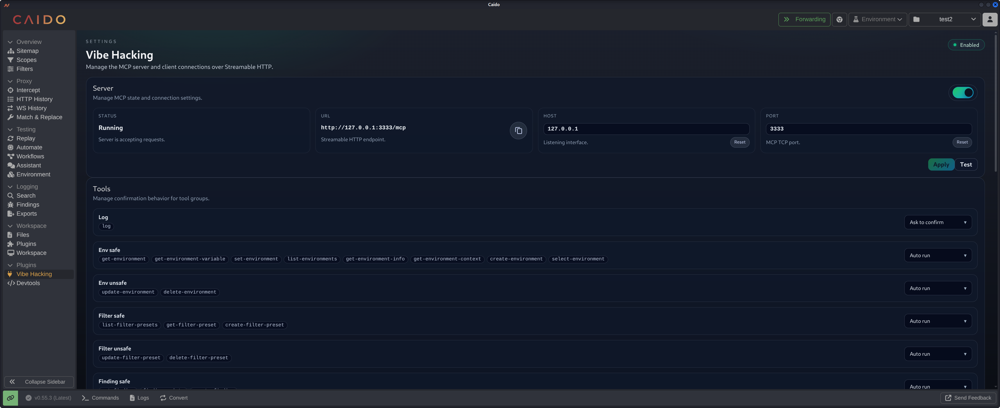

# Vibe Hacking

A Caido MCP plugin that exposes a clean, safe, and well‑documented tool surface for agents. It standardizes tool schemas, descriptions, and behaviors across requests, replay, filters, scopes, tamper rules, and WebSocket history.

## Highlights

- **MCP‑native**: exposes an MCP server over Streamable HTTP inside Caido.
- **Tool governance**: group tools into safe/unsafe buckets and control them with `auto`, `confirm`, or `disabled` modes.
- **Clear UX**: user‑friendly tool names in the UI (no SDK internals).
- **History-first output**: request and WebSocket tools use stable list/get envelopes, Caido-native filters, field projection, and bounded body serialization.



## Install

1. Build the plugin in this repo.
2. Load it in Caido as a local plugin.

> If you already have a dev flow, just build and load as usual.

## Compatibility

- **Caido**: v0.55.1+

## Usage

- Open the plugin page in Caido.
- Use the **Tools** section to set each group to `auto`, `confirm`, or `disabled`.
- Call tools from your agent and rely on consistent JSON outputs.

## API Control

The plugin exposes a localhost-only control endpoint at `http://127.0.0.1:<port>/control`.
When MCP also listens on a local host, both endpoints share one server. When MCP listens on
another interface, control stays local on the same port.

```bash
curl -sS -X POST "$CONTROL_URL" \
  -H "content-type: application/json" \
  -d '{"method":"setMcpServerEnabled","params":{"enabled":true}}'
```

Control requests are accepted only when the TCP peer is loopback, for example `127.0.0.1`
or `::1`. If MCP is bound to `0.0.0.0`, the control route is still served by that listener,
but non-loopback peers receive `403`.

Supported methods: `getMcpServerSettings`, `setMcpServerEnabled`,
`updateMcpServerConfig`, `getToolGroupPermissionModes`, `setToolGroupPermissionMode`,
and `setAllToolGroupPermissionModes`.

## Tooling Notes

- Some tools accept arrays even when the name is singular — this is intentional to support batch operations while keeping UI labels simple.
- Discovery tools are not scope-limited by default: `list_requests` returns all traffic (annotating `in_scope`), and Sitemap/WebSocket lists only filter by scope when an explicit `scope_id` is passed. Since Caido scopes are often broad (e.g. `.+`), narrow by host with HTTPQL (`req.host.eq` / `req.host.regex`) instead.
- Broad history discovery should start with `list_requests` / `list_websocket_messages` and tight `fields`; exact follow-up should use `get_requests_by_ids` / `get_websocket_messages_by_ids`.
- `list_requests` uses native Caido cursor pagination; feed `page_info.end_cursor`/`start_cursor` back as `cursor`.
- `list_requests.filter` is a raw HTTPQL string for method, host, status, port, time, path, raw, and row constraints.
- HTTP body output uses `{ encoding, size, text|base64, omitted_reason }`. Raw request/response bytes are returned only when requested through `fields`.
- `list_requests.serialization.include_body=false` by default for broad discovery; set it to `true` or request body/raw paths explicitly through `fields`.
- Sitemap tools expose Caido's deduplicated Sitemap tree; use `list_sitemap_roots` / `list_sitemap_descendants` for tree discovery and `list_sitemap_entry_requests` for cursor-paginated requests attached to one entry.
- Sitemap entry lists use offset pagination and return `has_more` / `next_offset`; they do not expose unusable GraphQL cursors.
- Sitemap entry lists use `request_limit=0` by default, which returns request counts without samples; set `request_limit>0` when projecting `requests.items.*`.
- Nested Sitemap `requests` include only `count` and optional sampled `items`; use `list_sitemap_entry_requests` for request pagination cursors.
- `list_sitemap_entry_requests` returns concrete HTTP history-shaped items and supports the same `serialization`, `regex_excerpt`, `fields`, and `exclude_fields` controls as `list_requests`.
- `fields` and `exclude_fields` project item payloads while preserving envelopes such as `page_info`, `items`, `requested`, `found`, and `results`.

## Core Tool Catalog

Request history:

- `list_requests`
- `get_requests_by_ids`
- `match_requests`
- `send_requests`
- `send_raw_requests`
- `check_requests_scope`
- `summarize_request_cookies`
- `summarize_request_auth_headers`

WebSocket/SSE:

- `list_websocket_streams`
- `get_websocket_streams_by_ids`
- `list_websocket_messages`
- `get_websocket_messages_by_ids`
- `get_websocket_message_edits_by_ids`

Sitemap:

- `list_sitemap_roots`
- `list_sitemap_descendants`
- `get_sitemap_entries_by_ids`
- `list_sitemap_entry_requests`

Environment:

- `list_environments`
- `get_environment`
- `get_environment_context`
- `create_environment`
- `update_environment`
- `delete_environment`
- `select_environment`
- `get_environment_variable`
- `list_environment_variables`
- `set_environment_variable`

Other existing groups cover Replay, Tamper rules, scopes, findings, hosted files, and project/runtime info.

Example request discovery:

```json
{
    "limit": 50,
    "filter": "req.host.eq:\"example.com\" AND req.method.eq:\"POST\" AND (resp.code.eq:200 OR resp.code.eq:401)",
    "fields": ["cursor", "id", "time", "request.method", "request.url", "response.status_code"]
}
```

## Development

```bash
pnpm install
pnpm build
```

Watch mode:

```bash
pnpm watch
```

## License

MIT
